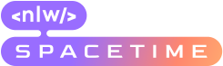
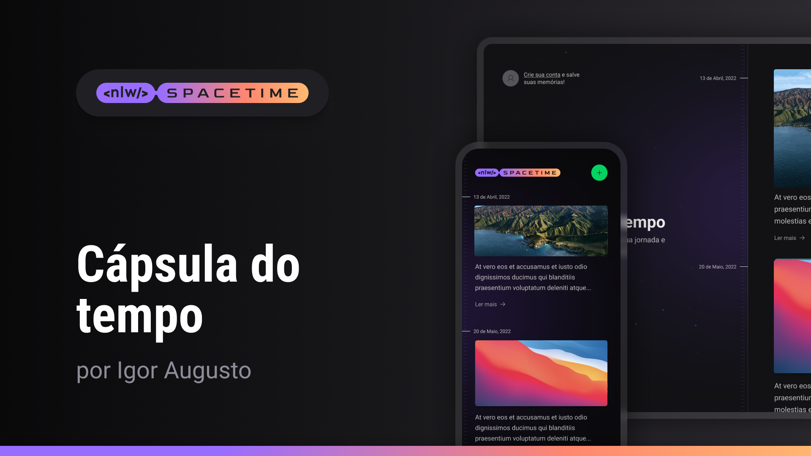

<h1 align="center">
 
  
   
  NLW - Spacetime
</h1>

 

NLW Spacetime é uma aplicação de recordação de memórias, onde o nosso usuário poderá adicionar à uma timeline textos, fotos e vídeos de acontecimentos marcantes da sua vida, organizados por mês e ano.

  <a href="#-tecnologias">Tecnologias</a>&nbsp;&nbsp;&nbsp;|&nbsp;&nbsp;&nbsp;
  <a href="#-projeto">Projeto</a>&nbsp;&nbsp;&nbsp;|&nbsp;&nbsp;&nbsp;
  <a href="#-layout">Layout</a>&nbsp;&nbsp;&nbsp;|&nbsp;&nbsp;&nbsp;
  <a href="#memo-licença">Licença</a>

  
  
  
  
  

